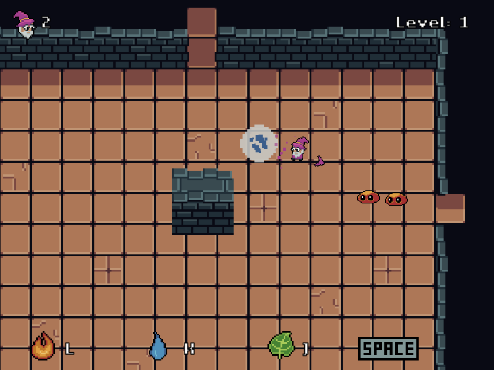
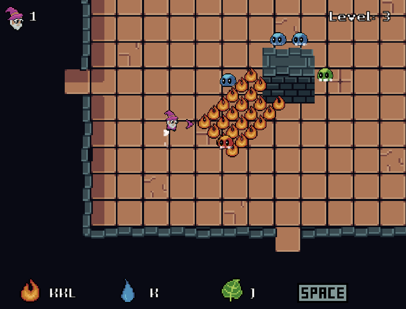

# Compounding-Casting-Confusion

https://anmoose.itch.io/compounding-casting-confusion

A 2D top down survival game created in the Unity engine. Play as a wizard defending against a horde of elemental slimes. Use your collection of spells and select the correct element to dispatch of your foes. Type the correct spell combination and press space to release your spell. Clear waves to upgrade your spells, but be careful, stronger spells come at the cost of greater complexity!

**Controls**
- W, A, S, D or Arrow Keys ...................... Move and Aim
- J, K, L .............................................................. Combine to Cast Spells
- Space Bar ....................................................... Release Spells
- Enter ................................................................. Start Next Level

This game was made as a submission for the Blackthornprod Game Jam #3 where the theme was "Less is More". All assets and code were created custom for this submission.

